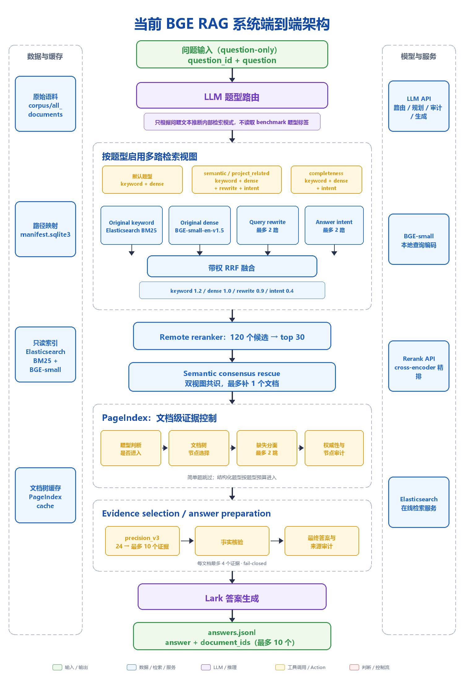
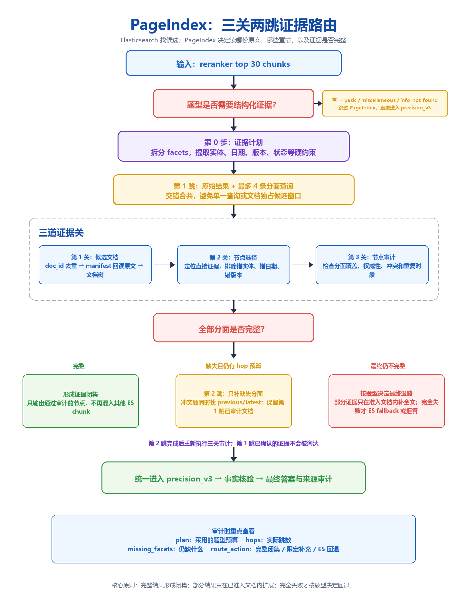

# BGE 测评 RAG 架构整体说明

## 1. 架构结论

五层组成：

1. **只读 BGE + Elasticsearch 索引层**：离线使用固定长度切割和 BGE-small 向量化；
2. **question-only 题型路由层**：只根据问题文本推断题型，不读取 benchmark 的 `question_type`、参考答案、gold facts 或 expected document IDs。
3. **多路召回与排序层**：按题型组合 BM25、原问题 dense、改写问题 dense、答案证据意图 dense，经带权 RRF 合并后，再由远端 reranker 精排；同时有受严格共识约束的 semantic rescue。
4. **PageIndex 结构化证据路由层**：对需要长文档、跨段、跨文档、冲突消解或穷举的题型，读取原文并构建文档树，执行文件准入、节点选择、缺失分面追检索、权威性过滤和节点审计。
5. **证据约束生成层**：先做 `precision_v3` 证据筛选，再生成答案、事实核验和最终答案/来源审计；输出的 `document_ids` 来自最终实际采用的证据。

## 2. 端到端数据流



> 飞书使用：将 [`bge-rag-end-to-end.png`](assets/bge-rag-end-to-end.png) 直接上传或粘贴到飞书文档；不需要 Mermaid 插件。

路由先决定检索视图，所有视图再汇入同一套 RRF、reranker 和 semantic rescue；
之后才判断是否进入 PageIndex。**题型路由不直接生成答案，而是先控制召回范围和结构化证据预算**。

## 3. 离线数据集构建、切割与索引层

本节区分两套使用同一 EnterpriseRAG 语料构建的向量数据集：**BGE-small** 是当前主线与 F500 正式评测索引；**Conan448** 是用于受控 A/B 的 1792 维实验索引，并未替换主线。

### 3.1 共同语料与三层数据资产

| 项目 | 参数 | 说明 |
|---|---:|---|
| 语料根目录 | `corpus/all_documents` | 全量企业 TXT 文档 |
| 原始 TXT 文件数 | 511,961 | 扫描时的物理文件数 |
| 唯一 `doc_id` 数 | 511,957 | 4 个重复 `doc_id` 已识别并单独记录 |
| 原始语料体积 | 2,473,624,226 bytes（约 2.47 GB） | 仅统计文件元数据，不依赖向量索引 |
| 数据来源 | 9 类 | Confluence、Fireflies、GitHub、Gmail、Google Drive、HubSpot、Jira、Linear、Slack |
| 关联主键 | `doc_id` | 连接 manifest、chunk 缓存、ES 文档和最终引用 |

```text
corpus/all_documents（原始 TXT）
        │
        ├── manifest.sqlite3：一原始文档一行，负责溯源、增量构建与原文回读
        ├── chunks.jsonl：一基础 chunk 一行，保存切片文本及字符偏移
        └── Elasticsearch：一可检索 chunk/vector 一文档，负责 BM25 与 dense 召回
```

`PageIndex` 不直接依赖 ES 中截断的候选文本；它先由 ES 返回 `doc_id`，再通过 manifest 定位并读取该 `doc_id` 对应的完整原文。因此，ES 的检索单元与 PageIndex 的原文阅读单元可以不同。

### 3.2 BGE-small 与 Conan448 构建参数对照

| 项目 | BGE-small 主线索引 | Conan448 实验索引 |
|---|---|---|
| ES 索引 | `enterprise-rag-bge-small-v1` | `enterprise-rag-qwen3-emb-v3-conan448` |
| 别名 | `enterprise-rag-bge-small` | `enterprise-rag-qwen3-emb-v3` |
| Embedding | `BAAI/bge-small-en-v1.5`，revision `5c38ec7c…` | 内网 OpenAI-compatible 服务，模型名 `embedding` |
| 向量维度 / 相似度 | 384 / cosine | 1792 / cosine |
| 切块器 | `fixed-v2`：按空白 token 固定切割 | `langchain_conan_recursive`：由服务端精确 tokenizer 计数的递归切割 |
| Chunk / overlap | 512 / 0 | 448 / 32 |
| 已写入的物理向量数 | 928,534 | 3,030,317 |
| 构建侧 Embedding | CUDA，batch 256 | API 调用；并发 8、group size 128、配置请求 batch 512 |
| ES 写入 | bulk 256 | bulk 2,048 |
| ES 分片 | 1（默认） | 16 |
| Dense 查询模式 | ES 原生 kNN | `script_score` + `cosineSimilarity` |
| 递归物理分区 | 无 | 服务端单输入上限为 512 token；超限 chunk 会拆为 `__pN` 分区 |

Conan 的 3,030,317 是物理检索记录数，不应与 BGE 的基础 chunk 数作一对一比较：除了 `448/32` 带来的更密切切分外，超长输入还会产生 `__pN` 递归分区。在线检索启用 `collapse_recursive_partitions=true`，避免同一原始 chunk 的多个分区挤占候选池。

### 3.3 Elasticsearch mapping 与文档字段

两套索引采用同一元数据 schema；区别是 `embedding` 的维度、分片数和 dense 查询模式。索引 mapping 为 `dynamic: strict`，`embedding` 是已建立索引的 `dense_vector`，相似度为 cosine；副本数为 0，刷新间隔为 30 秒。

| ES 字段 | 类型 | 作用 | 展示样例 |
|---|---|---|---|
| `_id` | ES 文档 ID | 幂等 bulk 写入的主键 | 与 `chunk_id` 相同 |
| `chunk_id` | `keyword` | 唯一检索片段 ID | `dsid_…__langchain-conan-v1-448-32__chunk00000` |
| `doc_id` | `keyword` | 同一原文下多个 chunk 的关联键 | `dsid_7c9c…c82bf` |
| `source_type` | `keyword` | 数据源分桶、过滤和审计 | `confluence` |
| `text` | `text` | BM25 全文检索与生成上下文 | `ADR-017: Retention policy …` |
| `chunk_index` | `integer` | 同文档相邻 chunk 扩展与顺序恢复 | `0` |
| `char_start` / `char_end` | `integer` | 在原文中的字符偏移 | `0` / `1186` |
| `embedding_model` | `keyword` | 写入向量时的模型可追溯标记 | `embedding` 或 `BAAI/bge-small-en-v1.5` |
| `embedding` | `dense_vector` | dense 检索向量；汇报中不展示完整数组 | `[0.018, -0.042, …]` |

以下为可直接用于汇报的**脱敏 ES 文档示例**。实际向量数组省略；Conan 的数组长度为 1792，BGE 为 384。

```json
{
  "_id": "dsid_7c9c…c82bf__langchain-conan-v1-448-32__chunk00000",
  "chunk_id": "dsid_7c9c…c82bf__langchain-conan-v1-448-32__chunk00000",
  "doc_id": "dsid_7c9c…c82bf",
  "source_type": "confluence",
  "text": "ADR-017: Retention policy evaluation in control plane …",
  "chunk_index": 0,
  "char_start": 0,
  "char_end": 1186,
  "embedding_model": "embedding",
  "embedding": "[1792 个 float，省略]"
}
```

`char_start` / `char_end` 是字符位置，而 448/512 是 token 切块目标，因此 Conan 示例中的 `char_end=1186` 并不与 448 token 冲突。

### 3.4 Manifest 与 chunk 缓存：文档级溯源

manifest 使用 SQLite，`documents` 表是一原始文件一行，不保存向量。它保存构建状态和版本指纹，并为 PageIndex 提供 `doc_id → file_path → 原文` 的回读路径。

| Manifest 字段 | 示例 | 作用 |
|---|---|---|
| `file_path` | `confluence/applied-ml-and-evals/dsid_…__adr-017…txt` | 语料目录内的相对路径 |
| `doc_id` | `dsid_7c9c…c82bf` | 与 ES chunk 关联的主键 |
| `source_type` | `confluence` | 来源分类 |
| `file_size` | `11504` | 原始文件大小 |
| `mtime_ns` | `<纳秒时间戳>` | 增量构建的变更检测 |
| `content_hash` | `<SHA-256>` | 内容版本识别 |
| `status` | `chunked` | 构建状态 |
| `chunk_count` | `11` | 该原文产出的基础 chunk 数 |
| `error_message` | 空字符串 | 构建异常时记录原因 |

```text
manifest.documents                         Elasticsearch
──────────────────                         ──────────────────────────────
doc_id = dsid_7c9c… ───────────────────▶  doc_id = dsid_7c9c…
file_path = …adr-017.txt                   chunk_id = …chunk00000
chunk_count = 11                            chunk_index = 0
                                           text + embedding + offsets
                              └──────────▶  chunk_id = …chunk00001
```

缓存目录中的 `_meta.json` 记录数据集签名、构建指纹、来源列表、`num_docs`、`num_chunks`、失败文件数和重复 `doc_id` 数。manifest 中的 `metadata` 表还保存 `preprocess_fingerprint` 与 `preprocess_complete`，用以判断增量构建是否可以安全复用。

### 3.5 测评时的只读隔离

当前 F500/AB50 测评配置使用：

```yaml
overwrite_index: false
read_existing_index: true
```

因此运行时会跳过 `Indexer.build()` 和 ES 写入，只加载查询 embedding 并连接版本化的既有索引。这样可防止测评触发语料扫描、重新切割、manifest 变更或索引污染。

### 3.6 BM25 与 dense

- **BM25** 擅长保留产品名、项目名、版本、日期、指标、错误码等精确词命中。
- **BGE dense** 擅长处理问题与原文表达不同、但语义相近的情况。
- **Conan dense** 提供不同的高维表示与更连续的 chunk 边界，但当前受控 50 题中没有证明它整体优于 BGE；高维度和 overlap 不能单独视作质量提升。

## 4. question-only 题型路由

### 4.1 输入隔离

当前配置启用：

```yaml
pipeline:
  question_only: true
  question_router:
    enabled: true
```

每道题进入在线链路时，代码取：

```text
question_id
question
```

benchmark 自带的 `question_type` 在 `question_only=true` 时会被显式置空。题型路由模型只接收问题文本和题型定义，输出一个内部路由标签。参考答案、gold facts、expected documents 不进入题型判断、检索、PageIndex 或生成环节。

如果路由模型返回非 JSON、未知标签或调用失败，题型为 `unknown`，PageIndex 规划器再使用非常保守的文本规则：出现 all/every/how many 等进入 exhaustive 候选；出现 latest/current/previous 等进入 conflict 候选；其余走单文档路径。

### 4.2 题型走不同流程

题型标签同时影响两个层面：

1. **召回视图**：是否增加 query rewrite 和 answer-intent dense 检索。
2. **证据模式**：PageIndex 需要看几份文档、多少节点、是否多跳、是否必须穷举。

| 推断题型 | PageIndex 证据模式 | 预计文档数 | 候选文档上限 | 每文档节点上限 | 最大跳数 | 主要处理逻辑 |
|---|---|---:|---:|---:|---:|---|
| `basic` | `single` | 1 | 10 | 0 | 0 | 直接事实查找，不启用 PageIndex |
| `miscellaneous` | `single` | 1 | 10 | 0 | 0 | 边缘/非正式内容，直接走排序结果 |
| `info_not_found` | `abstain` | 0 | 20 | 0 | 0 | 不启用 PageIndex，生成层保持证据不足则拒答的导向 |
| `semantic` | `single_semantic` | 1 | 30（实际受全局 24 限制） | 16 | 1 | 低词面重合的单文档事实；优先直接事件来源 |
| `intra_document_reasoning` | `single_multisection` | 1 | 10 | 8 | 2 | 在同一长文档的多个章节间组合证据 |
| `constrained` | `constrained_pair` | 2 | 16 | 12 | 2 | 同时满足日期、地区、产品、状态等硬约束，排除相似干扰文档 |
| `conflicting_info` | `conflict_pair` | 2 | 16 | 16 | 2 | 保留旧/新或冲突版本，再判断 latest/current/applied |
| `project_related` | `multi_hop` | 3 | 14 | 12 | 2 | 跨项目、跨文档完成因果链或关联推理 |
| `completeness` | `exhaustive` | 6 | 24 | 24 | 2 | 穷举、计数、去重，避免只找到代表性样本 |
| `high_level` | `corpus_level` | 6 | 24 | 24 | 2 | 跨语料综合，只保留顶层组织或总体结构 |


## 5. 多路检索与融合

### 5.1 不同题型启用的召回视图

| 题型分组 | Original keyword（BM25） | Original dense（BGE） | Query rewrite dense | Answer-intent dense |
|:---|:---:|:---:|:---:|:---:|
| `semantic` | 启用 | 启用 | 启用，最多 2 路 | 启用，最多 2 路 |
| `project_related` | 启用 | 启用 | 启用，最多 2 路 | 启用，最多 2 路 |
| `completeness` | 启用 | 启用 | **不启用** | 启用，最多 2 路 |
| 其他题型 | 启用 | 启用 | **不启用** | **不启用** |

“其他题型”包括 `basic`、`intra_document_reasoning`、`constrained`、`conflicting_info`、`miscellaneous`、`high_level` 和 `info_not_found`。

两类扩展查询都只允许使用原问题中的实体和硬约束：

- **rewrite query**：把问题重写成更接近文档语言的自然语言检索式，不能删掉日期、地区、版本、数量等约束。
- **answer-intent query**：描述“回答该问题必须找到什么证据”，不能猜测实际答案、人物、数值或结论。

### 5.2 带权 RRF

各路结果按 `chunk_id` 去重，融合分数为：

```tex
RRF(chunk) = Σ weight(view) / (rrf_k + rank_in_view)
```

当前 `rrf_k=60`，各视图权重为：

| 视图 | 权重 |
|---|---:|
| 原问题 BM25 | 1.2 |
| 原问题 dense | 1.0 |
| rewrite dense | 0.9 |
| answer-intent dense | 0.4 |


### 5.3 候选池与 reranker 

开启 reranker 后，主多视图链路的每个 BM25/dense 视图会取 `reranker.candidate_k=120` 条结果，RRF 合并后仍保留 120 条，再送远端 `/v1/rerank`，最终保留 30 条。

```text
每个主视图 top 120
        ↓
带权 RRF 合并为 120
        ↓
cross-encoder rerank
        ↓
top 30
```

配置中的 `retrieval.candidate_k=240` 主要用于 `retrieve_hybrid()`：即 PageIndex 的后续分面查询/缺失证据查询所使用的稳定原始 hybrid 路径。它不是主多视图 RRF 的最终池大小。

稳定 hybrid 路径内部会分别取 BM25 240 和 dense 240，按 `dense_weight=0.3` 做 RRF，输出由 retriever 的 `top_k=120` 截断。这样 PageIndex 的每个追问不会递归触发全部 rewrite/intent 视图，避免查询和 LLM 调用数量指数增长。

## 6. PageIndex

### 6.1 解决问题

- Elasticsearch 负责回答：  相关chunk
- PageIndex 负责回答：**应该读哪份原文、原文中的哪几个章节、证据是否完整且版本正确？**

简单事实题不进入 PageIndex；只有长文档、跨段、跨文档、冲突、穷举或全局综合题才进入。

### 6.2 PageIndex 跳转



> 飞书使用：将 [`pageindex-three-gates-two-hops.png`](assets/pageindex-three-gates-two-hops.png) 直接上传或粘贴到飞书文档。

跳转规则：

1. **先计划，再看树**：PageIndex 先把问题拆成必须有证据支持的分面，例如“旧值”“新值”“生效时间”，再去文档树中定位节点。
2. **第一跳做广覆盖**：原始 rerank 结果与最多 4 条分面查询交错合并，让每个分面和文档都有进入候选区的机会。
3. **第二跳只补缺口**：只有第一次审计仍缺证据时才执行；不会再次完整扩写问题，也不会递归触发所有多视图检索。
4. **已审计证据不会被淘汰**：第二跳合并结果时，先保留第一跳已通过的节点和文档，防止新召回把正确证据挤走。
5. **完整结果是闭集**：一旦全部分面通过审计，只把 PageIndex 认可的节点交给生成器，不再混入其他 ES chunk。

### 6.3 不同题型进入 PageIndex 

| 题型 | PageIndex 首要目标 | 证据不完整时的跳转 |
|:---|:---|:---|
| `semantic` | 在一份直接来源中找到低词面重合的事实 | 最多 1 跳；优先读取指定事件来源，必要时在该文档内读取有界全文，不回退到任意 ES 文档 |
| `intra_document_reasoning` | 找到同一长文档中互相依赖的多个章节 | 根据缺失章节执行第 2 跳；仍不完整时只补已准入文档内容 |
| `constrained` | 从相似文档中筛出同时满足实体、日期、地区、产品和状态约束的文档 | 第 2 跳只补未满足的硬约束；最终无有效文档时允许回到原始 ES 结果 |
| `conflicting_info` | 同时保留同一对象的旧版与新版证据 | 少于 2 份版本文档时，第 2 跳专门搜索 previous/latest 配对，再按 final/applied/proposed 判断权威版本 |
| `project_related` | 串联多个项目或文件之间的因果/依赖关系 | 第 2 跳搜索缺失链路；已通过文件级权威过滤的文档可按有界全文保留完整生命周期 |
| `completeness` | 找全、计数并按独立 intake/report/ticket 去重 | 第 2 跳继续找缺失对象；排除外发通知和后续跟进，最终优先每份已准入文档的一条完整证据 |
| `high_level` | 从多份文件综合顶层组织或全局结构 | 分散线索不足时执行组织结构 sweep；只保留顶层部门，不把子团队和一般职能升级为部门 |

### 6.4 三个跳转示例

**示例 A：语义题询问某次会议中的部署周期**

```text
semantic → keyword+dense+rewrite+intent → rerank
→ PageIndex 优先 Fireflies → 会议原文树 → 找到部署/周期节点
→ 若同一会议的时间线仍缺一段，则读取该会议的有界全文
→ precision_v3
```

不会因为节点不完整就跳到任意项目总结；问题明确要求会议内容时，一手会议记录优先。

**示例 B：冲突题询问旧方案和当前方案的差异**

```text
conflicting_info → keyword+dense → rerank
→ 第 1 跳找到当前版本 → 节点审计发现“旧版本”分面缺失
→ 第 2 跳只搜索 previous/earlier version
→ 保留第 1 跳当前版本 + 新找到的旧版本 → 再审计 → 输出版本对
```

第二跳不是重新做一遍全流程，而是由 `missing_facets` 精确触发；第一跳已经确认的当前版本不会被淘汰。

**示例 C：完整性题统计多个渠道的报告数量**

```text
completeness → keyword+dense+intent → rerank
→ 第 1 跳按渠道找 intake/report/ticket → 文档级去重
→ 审计发现某一渠道未覆盖 → 第 2 跳只检索该渠道
→ 排除外发通知和后续跟进 → 每个真实入站对象计数一次
→ 将准入对象集合交给生成器汇总
```

这类题的关键不是找到“最相关的一篇”，而是尽量找到全部独立对象，因此使用 exhaustive 预算和对象级去重。

### 6.5 文档树接入现有语料

1. `ManifestDocumentStore` 以 SQLite `mode=ro` 打开 `manifest.sqlite3`，用 `doc_id/source_type` 找到原始 TXT；该过程不改 manifest。
2. `TextStructureAdapter` 将 TXT 转成 Markdown 层级，保留原有标题，并识别 Confluence、Google Drive、Jira、Linear、GitHub、HubSpot 中的 Summary、Status、Decision、Resolution 等结构。
3. 对会议、邮件或聊天等没有明确标题的文本，每 5 个段落合成一个章节，使它们也可以按节点导航。
4. PageIndex 根据 Markdown 构建章节树；缓存键为“适配器版本 + 文本内容”的 SHA-256。文本或适配逻辑变化时自动重建，否则直接复用 tree cache。
5. 当前每题最多处理 24 份候选文档、每文档最多 40 个节点，每个节点向选择器展示 800 字符预览。


## 7. 证据选择、生成和引用

### 7.1 precision_v3 证据门

PageIndex 或 ES 输出进入生成器后，先按顺序和文档配额截取最多 24 个候选证据，再由 `precision_v3` 判断：

- 问题包含哪些独立事实分面；
- 每个分面由哪些候选片段直接支持；
- 是否存在冲突；
- 是否达到完整覆盖。

最终最多采用 10 个证据片段，每文档最多 4 个。当前 `anchor=0`、`fallback=0`、`fail_closed=true`：选择器输出无效或完全没有可接受证据时，不会强行保留检索 top chunk。

两个受控例外：

- `completeness` 需要看到 PageIndex 已准入的每个独立对象，避免二次选择器提前停止；
- `high_level` 需要看到受控范围内分散于多个文档的组织线索。


### 7.2 生成后的两道审计

1. **事实核验**：对草稿中的每个事实检查是否被已选证据支持，并结合题型规则处理最新版本、穷举计数和高层归纳。
2. **最终答案与来源审计**：允许修订答案，同时返回真正使用的 evidence indices；最终 `document_ids` 只从这些证据的父文档去重生成，最多 10 个。

## 8. 关键参数表

| 层 | 参数 | 当前值 |
|---|---|---:|
| Index | chunk size / overlap | 512 / 0 |
| Index | embedding | BGE-small-en-v1.5，384 维，CPU |
| Retrieval | 主多视图每路候选 | 120 |
| Retrieval | 主 RRF 池 | 120 |
| Retrieval | rerank 输出 | 30 |
| Retrieval | stable hybrid candidate_k | 240 |
| Retrieval | hybrid dense weight | 0.3 |
| Retrieval | RRF k | 60 |
| Semantic rescue | 独立查询 | 1 rewrite + 1 intent |
| Semantic rescue | 每路 rerank / 共识文档窗口 | 8 / 2 |
| Semantic rescue | 最大新增文档 | 1 |
| PageIndex | 全局候选文档 / 每文档节点 | 24 / 40 |
| PageIndex | 节点预览 | 800 字符 |
| PageIndex | follow-up queries / hops | 4 / 2 |
| PageIndex | 一般/直接事件全文上限 | 18,000 / 40,000 字符 |
| Generation | selector 候选 / 最终证据 | 24 / 10 |
| Generation | 每文档最大证据 | 4 |
| Generation | 最大 document IDs | 10 |
| Runtime | question parallelism | 1 |
| Runtime | checkpoint interval | 1 |

## 9. 代码定位

| 模块 | 关键职责 |
|---|---|
| [`src/pipeline.py`](../src/pipeline.py) | 总编排、question-only 隔离、题型路由、多视图、RRF、semantic rescue、PageIndex 调用、并发和检查点 |
| [`src/elasticsearch_backend.py`](../src/elasticsearch_backend.py) | ES BM25/dense/hybrid、远端 reranker、递归分片折叠 |
| [`src/indexer.py`](../src/indexer.py) | 离线语料读取、fixed-v2 切割、manifest 和索引缓存 |
| [`src/pageindex_router.py`](../src/pageindex_router.py) | 题型证据计划、TXT→Markdown、树缓存、节点选择、多跳、权威性和完整性审计 |
| [`src/generator.py`](../src/generator.py) | precision_v3、证据预算、答案生成、事实核验、最终答案/来源审计 |
| [`src/evaluator.py`](../src/evaluator.py) | 答案格式校验、官方 `--no-correction` 调用、简单召回指标 |
| [`configs/eval_pageindex_ab50_semantic_consensus_20260820_r3_on.yaml`](../configs/eval_pageindex_ab50_semantic_consensus_20260820_r3_on.yaml) | 当前 PageIndex ON 配置 |

## 10.  500 题测试结果

当采用官方 `metrics_based_eval --no-correction`，问题生成链路为 question-only。

| 题数 | Correctness | Completeness | Combined | Recall | Invalid Extra Docs |
|---:|---:|---:|---:|---:|---:|
| 500 | 60.60% | 62.57% | **55.18** | 61.12% | 0.18 |
