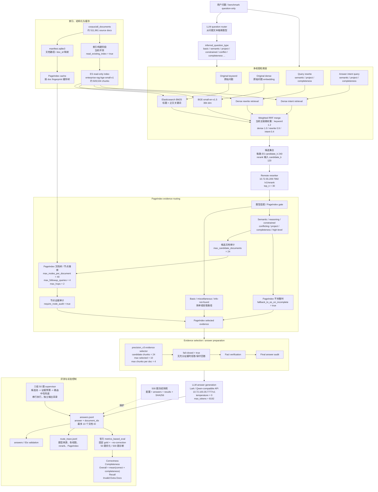

# Current RAG Architecture — 2026-08-18

当前主链路是 BGE-small + Elasticsearch hybrid retrieval + remote reranker + PageIndex evidence routing。
实验和评测均使用 question-only 输入，不把 benchmark 的题型、gold answer 或 expected document IDs 传入检索和生成链路。

## Current fixed configuration

- 主配置：[eval_pageindex_full500_bge_rerank_question_only_llm_route_multiview_p0_20260817.yaml](../configs/eval_pageindex_full500_bge_rerank_question_only_llm_route_multiview_p0_20260817.yaml)
- 500 题快照：[eval_pageindex_full500_bge_rerank_question_only_llm_route_multiview_p0_20260817.yaml](../configs/snapshots/eval_pageindex_full500_bge_rerank_question_only_llm_route_multiview_p0_20260817.yaml)
- 50 题实验使用同一固定题目集合、独立 `pipeline.name`、独立 PageIndex cache 和独立输出目录。
- 当前三组优化测试串行运行，避免同时占用 LLM、embedding、reranker 和 PageIndex 资源。

## Main bottleneck locations

目前从 Lexical A/B 结果看，BM25 权重变化没有改变最终 `document_ids`；候选池扩展还使 Overall 从 59.14 降到 59.01。因此后续瓶颈重点是：

1. LLM 路由是否把问题送入了不合适的 PageIndex / evidence 流程；
2. precision_v3 是否过度收缩了已经召回的证据；
3. 事实验证和 final answer audit 是否在低证据覆盖时过早拒答。
